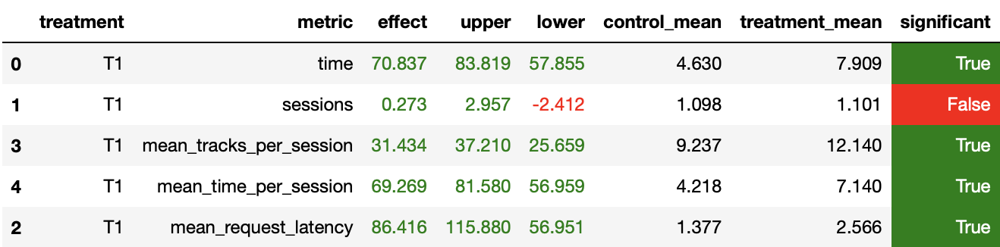

# Домашнее задание 1. Рекомендер музыкальных треков.

##1. Abstract

[Contextual](botify/botify/recommenders/contextual.py) рекомендер позволяет предложить пользователю трек рекомендуемый на основе предыдущего прослушенного трека. Но предыдущий трек мог не понравиться пользователю (пользователь его пропустил), тогда не стоит предлагать рекомендуемый трек для этого пропущенного трека. Гораздо больше смысла предлагать пользователю трек, рекомендуемый по последнему понравившемуся треку (дослушенному).

При этом имеет место использовать user-based подход, частично реализованный в рекомендере [Indexed](botify/botify/recommenders/indexed.py). Если для предыдущего понравившегося трека есть пользователи, для которых этот трек также понравился, то можно использовать контекстную рекомендацию для того пользователя, иначе можно использовать рекомендации для пользователя или контекстные рекомендации.

Также стоит сохранять для трека пользователей, которые его оценили, для увеличения выборки похожих пользователей. 

##2. Детали

Заведена 2 key-value БД для хранения понравившихся треков для каждого пользователя **prev_goods** (они же **избранные**) и пользователей, положительно оценивших конкретный трек **user_recommendations**. [See config](botify/botify/config.json) [See server](botify/botify/server.py)

Реализован [рекомендер](botify/botify/recommenders/mega_recommender.py):

В качестве fallback будут выступать рекомендеры [Contextual](botify/botify/recommenders/contextual.py) и [Indexed](botify/botify/recommenders/indexed.py). В runtime будет добавляться трек в **избранные** для пользователя, прослушевшего трек дольше определенного времени (некоторая управляемая константа). Также будет добавляться для понравившегося трека пользователь, которому "зашло". Если трек *не понравился*, будет выбран другой случайный предыдущий трек из числа понравившихся. Если таковых нет, то вернется индекс для данного пользователя. 

Далее для полученного предыдущего понравившегося трека берется случайный пользователь, которому тоже "зашел" этот трек, и контекстное предложение для найденного пользователя рекомендуется текущему пользователю. Если пользователей, для которых понравился этот трек нет, то будет рекомендоваться контекст для текущего пользователя.

С помощью тернарного поиска локализуется выше указанная переменная — граница, разделяющая прослушенный и не прослушанный трек. 

##3. Результаты A/B эксперимента

Данные получены благодаря симуляции
```
python sim/run.py --episodes 1000 --config config/env.yml multi --processes 2
```

Эксперимент проведен согласно [jupiter notebook](jupyter/Week1Seminar.ipynb) из 1 семинара. В результате реализованный [рекомендер](botify/botify/recommenders/mega_recommender.py) оказался существенно лучше [Contextual](botify/botify/recommenders/contextual.py) по ряду параметров, в том числе по требуемому **mean_time_per_session**.



##4. Инструкции

Программа запускается, тестируется и используется согласно описанию на семинарах, а также в ранее выложенных Readmes: [botify](botify/README.md), [simulator](sim/README.md)

Каждый пункт рассматривается из корня репозитория

1. Запустить botify в docker: 
```
cd botify
docker-compose up -d --build
```
2. Запустить sim у себя на машине
```
cd sim
python -m venv env
pip install -r requirements.txt
export PYTHONPATH=${PYTHONPATH}:.
python sim/run.py --episodes 1000 --config config/env.yml multi --processes 2
```
3. Забрать данные
```
cd sim
docker cp recommender-container:/app/log/ tmp
```
4. Посмотреть результаты в [Week1Seminar.ipynb](jupyter/Week1Seminar.ipynb), указав путь к данным в ячейке 3 и запустив все ячейки последовательно